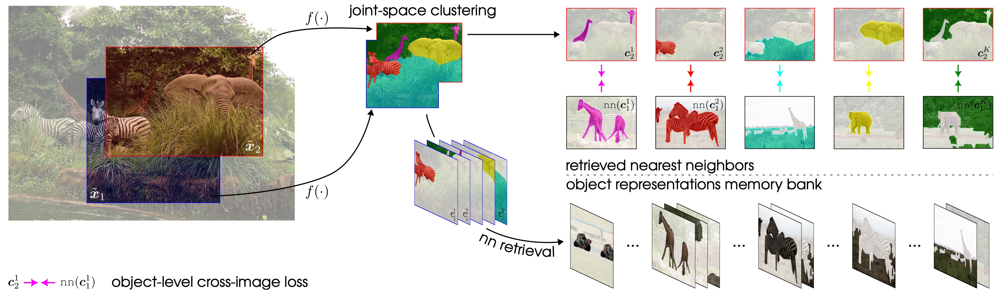

# CrIBo
[[`arXiv`](https://arxiv.org/pdf/2310.07855)]

This repo contains the Pytorch implementation of our ICLR 2024 paper (spotlight):
> [**CrIBo: Self-Supervised Learning via Cross-Image Object-Level Bootstrapping**](https://arxiv.org/pdf/2310.07855.pdf)
>
>[Tim Lebailly*](https://www.timlebailly.com/), [Thomas Stegmüller*](https://people.epfl.ch/thomas.stegmuller?lang=en), [Behzad Bozorgtabar](https://behzadbozorgtabar.com/), [Jean-Philippe Thiran](https://people.epfl.ch/jean-philippe.thiran) and [Tinne Tuytelaars](https://homes.esat.kuleuven.be/~tuytelaa/).




## Dependencies
Our code only has a few dependencies. First, install PyTorch for your machine following [https://pytorch.org/get-started/locally/](https://pytorch.org/get-started/locally/).
Then, install other needed dependencies:
```bash
pip install einops
```

## Pretraining
### Single GPU pretraining
Run the [main_cribo.py](main_croc.py) file. Command line args are defined in [parser.py](cribo_utils/parser.py).
```bash
python main_cribo.py
```

**Make sure to use the right arguments specified in the table below!**

### 1 node pretraining
The code is compatible with slurm. For running on a single node with 8 GPUs:
```bash
#!/bin/bash
#SBATCH --job-name=cribo
#SBATCH --account=<slurm_account>
#SBATCH --cpus-per-task=7
#SBATCH --gpus-per-node=8
#SBATCH --mem=<mem>
#SBATCH --nodes=1
#SBATCH --ntasks-per-node=8
#SBATCH --open-mode=append
#SBATCH --time=4320

master_addr=$(scontrol show hostnames "$SLURM_JOB_NODELIST" | head -n 1)
export MASTER_ADDR=$master_addr
export MASTER_PORT=12802

srun --unbuffered \
python main_dino.py \
--imagenet1k_path /path/to/ilsvrc2012 \
--output_dir . \
--n_tokens 32 \
--queue_size 25000 \
--pos_alpha 1.0 1.0 \
--arch vit_small
```
Alternatively, you can use `torchrun` or `torch.distributed.launch` (deprecated):
```bash
python -m torch.distributed.launch --nproc_per_node=8 main_cribo.py \
--imagenet1k_path /path/to/ilsvrc2012 \
--output_dir . \
--n_tokens 32 \
--queue_size 25000 \
--pos_alpha 1.0 1.0 \
--arch vit_small
```
## Citation
If you find our work useful, please consider citing:

```
@misc{lebailly2023cribo,
      title={CrIBo: Self-Supervised Learning via Cross-Image Object-Level Bootstrapping}, 
      author={Tim Lebailly and Thomas Stegmüller and Behzad Bozorgtabar and Jean-Philippe Thiran and Tinne Tuytelaars},
      year={2023},
      eprint={2310.07855},
      archivePrefix={arXiv},
      primaryClass={cs.CV}
}
```

## Pretrained models
You can download the full checkpoint which contains backbone and projection head weights for both student and teacher networks. We also provide detailed arguments to reproduce our results.

<table class="center">
  <tr>
    <th>pretraining dataset</th>
    <th>arch</th>
    <th>params</th>
    <th>batchsize</th>
    <th>Dense NN retrieval ADE20k (mIoU)</th>
    <th>Dense NN retrieval PVOC12 (mIoU)</th>
    <th colspan="2">download</th>
  </tr>

  <tr>
    <th>COCO</th>
    <th>ViT-S/16</th>
    <th>21M</th>
    <th>256</th>
    <th>23.4</th>
    <th>58.1</th>
    <td><a href="https://rdr.kuleuven.be/api/access/datafile/159667">ckpt</a></td>
    <td><a href="https://github.com/tileb1/CrIBo/checkpoints/vits16-coco_args.json">args</a></td>
  </tr>

  <tr>
    <th>ImageNet-1k</th>
    <th>ViT-S/16</th>
    <th>21M</th>
    <th>1024</th>
    <th>28.3</th>
    <th>73.2</th>
    <td><a href="https://rdr.kuleuven.be/api/access/datafile/159665">ckpt</a></td>
    <td><a href="https://github.com/tileb1/CrIBo/checkpoints/vits16-in_args.json">args</a></td>
  </tr>
  <tr>
    <th>ImageNet-1k</th>
    <th>ViT-B/16</th>
    <th>85M</th>
    <th>1024</th>
    <th>30.0</th>
    <th>74.9</th>
    <td><a href="https://rdr.kuleuven.be/api/access/datafile/159666">ckpt</a></td>
    <td><a href="https://github.com/tileb1/CrIBo/checkpoints/vitb16-in_args.json">args</a></td>
  </tr>
</table>

```python
import torch

checkpoint_to_load = 'vitb16-in.pth' # Choose the checkpoint to load
loaded = torch.load(checkpoint_to_load, map_location='cpu')
print(loaded.keys())
```


## Acknowledgments

This code is adapted from [CrOC](https://github.com/stegmuel/CrOC) which is based on the codebase of [DINO](https://github.com/facebookresearch/dino).
